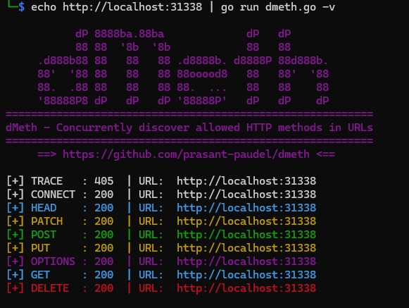

# dMeth - A tool to discover allowed HTTP methods in a URL

## Installation
```
go install github.com/4lch3mis7/dmeth@latest
```

## Screenshots
 


## Usage
Flag | Description          
-----|------------
-s   | Allowed status codes
-b   | Blocked status codes
-m   | Allowed HTTP methods to look for
-v   | Show all responses (including `405` i.e. `Method Not Allowed`)
-h   | Show help menu  

## Examples
```
dmeth https://example.com
```
```
dmeth -s 200,301 -m post,delete target_urls.txt
```
```
echo "https://example.com" | dmeth -b 405 -m post
```
```
cat target_urls.txt | dmeth
```
