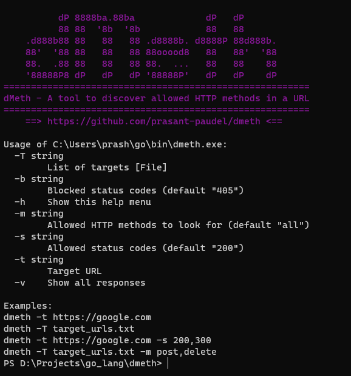
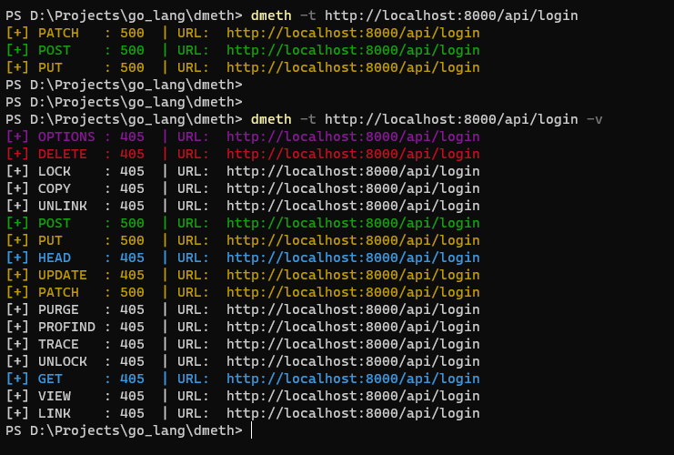

# dMeth - A tool to discover allowed HTTP methods in a URL

## Installation
```
go install github.com/prasant-paudel/dmeth@latest
```

## Screenshots
Screenshot 1 <br>
 

Screenshot 2 <br>



## Usage
Flag | Description          
-----|------------
-t   | Target URL   
-T   | LIst of targets
-s   | Allowed status codes
-b   | Blocked status codes
-v   | Show all responses (including `405` i.e. `Method Not Allowed`)
-h   | Show help menu  

## Examples
```
dmeth -t https://google.com
```
```
dmeth -v -t https://google.com
```
```
dmeth -T target_urls.txt
```
```
dmeth -t https://google.com -s 200,300
```
```
dmeth -T target_urls.txt -s 200,300
```
```
dmeth -T target_urls.txt -m post,delete
```
